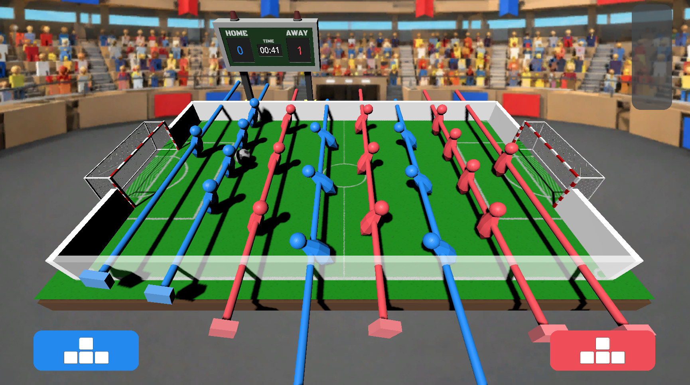
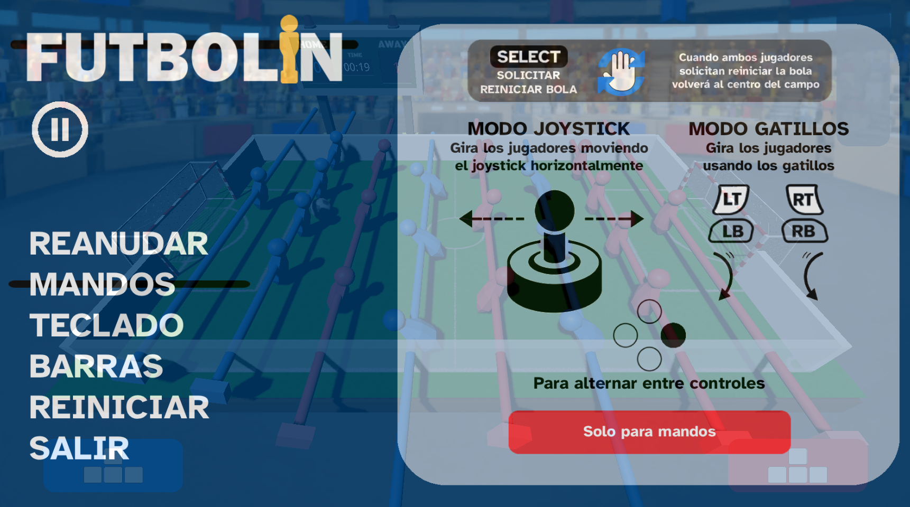

# Futbolin

Local multiplayer foosball playable with controllers or keyboard.  
This is a fast, simple, and fun digital version of the classic foosball table.

The main goal behind the project was to create an arcade-style game that feels great with controllers — especially Joy-Cons — while still offering full two-player keyboard support for accessibility and convenience.

---

## 🎮 Features
- Fast and responsive gameplay
- Smooth bar controls
- Local multiplayer support
- Controller and keyboard compatibility
- Simple arcade-style scoring
- Minimalistic and clean presentation
- 90-second matches

---

## 📸 Screenshots

### Main Menu

### Gameplay

### Controllers

---

## 🌐 Game Page
You can play the game directly in your browser on itch.io  
(**Mozilla Firefox recommended for dual-controller support**)

👉 https://luisdavidparra.itch.io/futbolin

---

## 📦 Download
Download the playable build from the **Releases** section.

---

## 🙏 Credits
Models used in the project:
- [Soccer Ball](https://sketchfab.com/3d-models/soccer-ball-12d3c94de2d341618a119789d56d4678)
- [Scoreboard](https://sketchfab.com/3d-models/scoreboard-a69de1385cde43cda5de7b40b4451694)

---

## ℹ️ About This Repository
This repository is meant to publicly showcase the game without exposing the source code.  
Only media, documentation, and compiled builds are provided.
